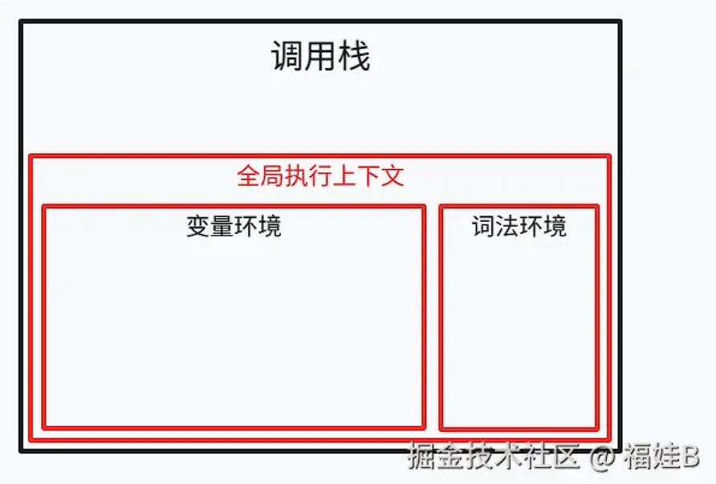
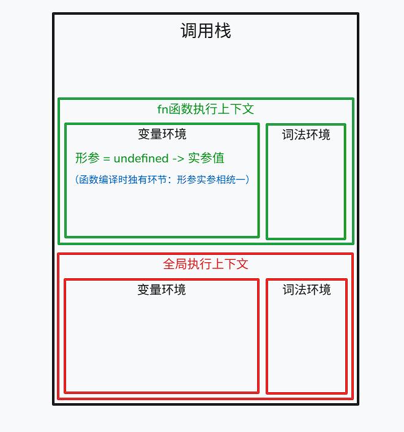
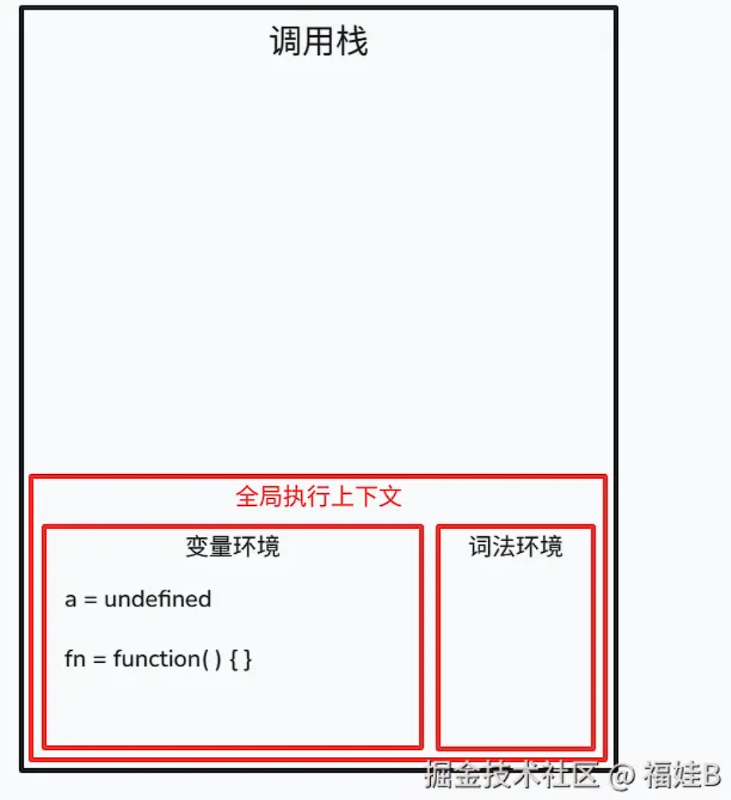
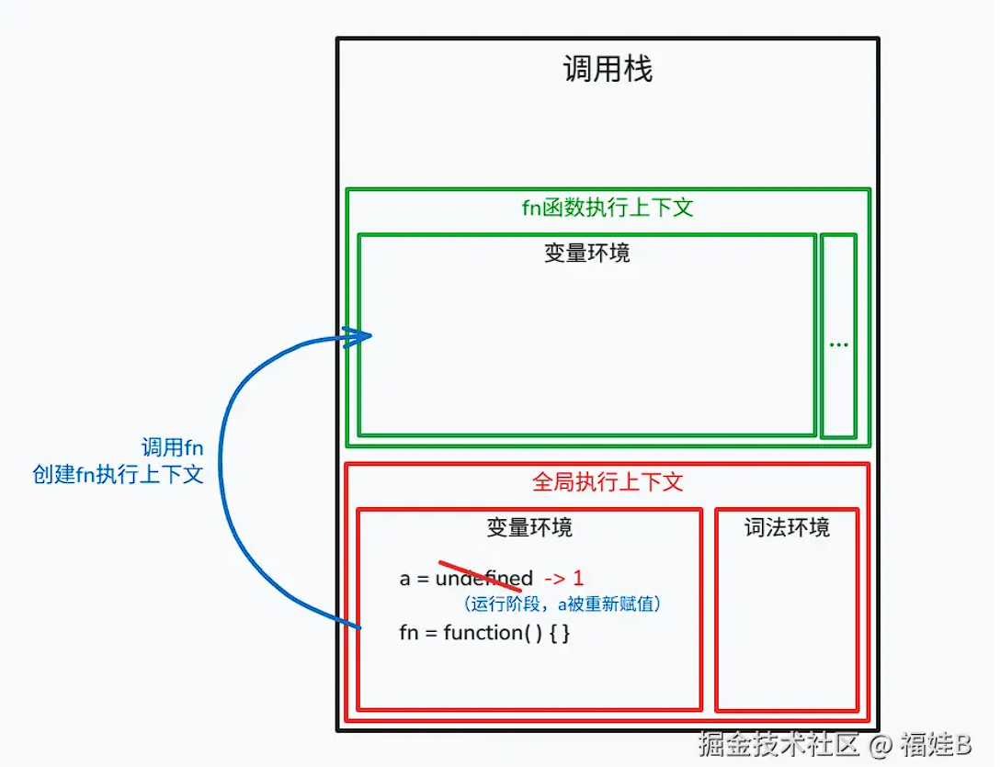
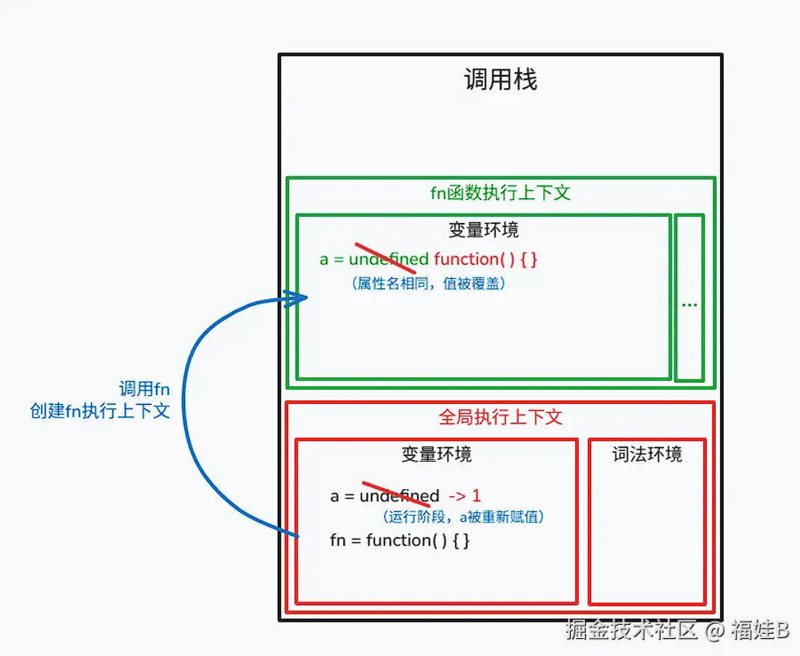
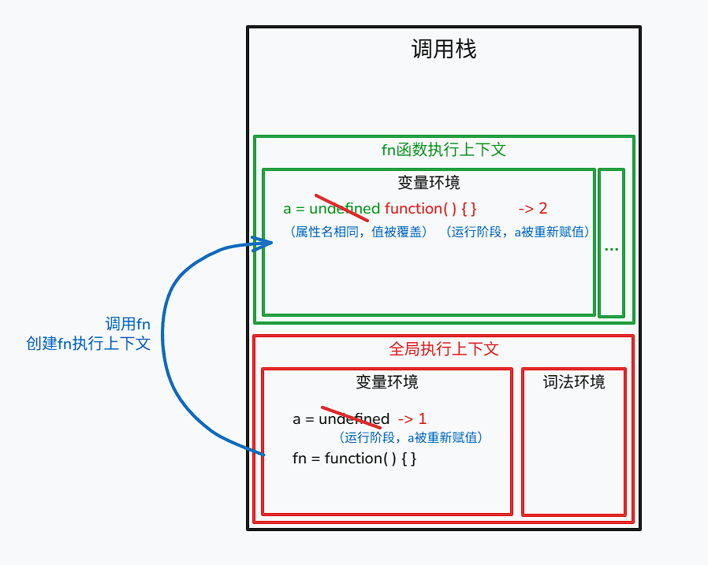
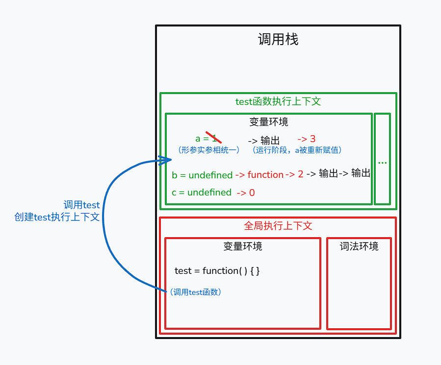

# JS运行机制
> `V8`引擎中，`JS`代码的运行分成***读取代码 -> 编译代码 -> 运行*** 三步

- 编译过程中，引擎主要的工作是将 **【变量声明】** 和 **【函数声明】** 提升，将它们值设为`undefined`
- 运行过程中，完成声明后的变量在对应作用域中被做 **【赋值操作】**，再按代码书写顺序执行

<br>

## 编译

> 编译及运行顺序：***编译全局 -> 执行全局 -> 编译函数 -> 执行函数***

- 编译时，v8引擎会生成一个调用栈。马上入栈一个执行上下文，此时的执行上下文是全局的。
  接下来在全局执行上下文中会有一个空间叫 **【变量环境】**，其中存放全局环境声明的变量。



- 全局编译完成后，引擎执行全局代码，碰到需要调用运行的函数则将其编译再运行。
> **注意**：全局代码没有运行完毕，全局执行上下文不能销毁出栈，函数执行上下文直接进栈




知道了编译运行的流程，现在我们就来深入理解两个执行上下文编译过程中的具体步骤

### 全局编译步骤

1. 创建全局执行上下文 **对象**
2. 找变量声明，将形参和变量名作为执行上下文的**属性名，值为`undefined`**
3. 在上下文中找 **函数声明** ，函数名作为执行上下文的**属性名，值为函数体**

### 函数编译步骤
1.  创建函数执行上下文 **对象**
2.  找形参和变量声明，将形参和变量名作为执行上下文的**属性名，值为`undefined`**
3.  将形参和实参相统一 
4.  在上下文中找 **函数声明** ，函数名作为执行上下文的**属性名，值为函数体**

> **注意**：形如`var fun = function() {}`属于函数表达式，**不属于函数声明**，编译过过程中的操作遵循变量的声明，只有在**执行代码过程中**会将函数体赋值给对应变量

### 代码执行阶段
1. 按照代码书写顺序从上往下执行
2. 找到目标变量进行赋值操作

## 案例一
大体规则知道了咱们来一串代码感受一下

```js
var a = 1
function fn() {
    var a = 2
    function a() {}
    console.log(a) // function{}
}
fn()
```

同学们按照惯例一层层往下分析的时候就发现不对了，可能想给写代码的同学来一刀：你这老东西怎么写两个`a`，后面还有对`a`的输出？ 别急别急，咱们按照上面的步骤画图一步步分析就懂了

### 全局编译阶段



#### 【小知识1】为什么编译时函数其中的函数体不管？

因为函数只要不调用，其中都是空，仅仅只是函数声明。所以只存在一个空函数`fn = function(){}`，
只有在调用函数时会进入函数体编译运行

>  函数被调用时，会有对应函数的执行上下文被入栈，其中再存放函数中的变量与各种声明

### 全局执行阶段

- 从上往下执行代码，对变量进行赋值操作
- 如果有需要调用的函数，对函数进行编译运行



***此时发现调用了函数`fn` --接下来进行函数的编译执行***

### 函数编译过程



#### 【小知识2】为什么函数执行上下文中的变量`a`的值会有改动？

>  1. 全局中的`a`值的改变是因为执行阶段会对具体变量进行赋值操作
>  2. 函数中编译时`var`先声明了一个`a`，接着马上声明了一个同名函数`a`，导致前一个值被覆盖

##### 【追问】为什么不是在函数执行上下文中再多创建一个`a`？

>  因为这些变量的声明都是发生在执行上下文 **【对象】** 中且作为对象中的一个 **【属性】**，而`JS`中对象的属性可以直接被修改覆盖，如下例子：

```js
var obj = {
  name: '福娃B',
  age: 18,
}
console.log(obj) // 18

obj.age = 19

console.log(obj) // 19
```

### 函数执行阶段



## 案例1小结
由此可见，在`fn`中的`log`打印语句会找到该作用域下的`a`(变量值已变为`2`) 并对其输出

## 案例2
```js
function test(a, b) {
    console.log(a); // 1
    c = 0
    var c;
    a = 3
    b = 2
    console.log(b); // 2
    function b() {}
    console.log(b); // 2
  }
  test(1);
```
图解：



# 补充知识点

## 1. 作用域与执行上下文

作用域和执行上下文之间最大的区别是： **执行上下文在运行时确定，随时可能改变；作用域在定义时就确定，并且不会改变**

一个作用域下可能包含若干个上下文环境。有可能从来没有过上下文环境（函数从来就没有被调用过）；有可能有过，现在函数被调用完毕后，上下文环境被销毁了；有可能同时存在一个或多个（闭包）。

**同一个作用域下，不同的调用会产生不同的执行上下文环境，继而产生不同的变量的值**

## 2. 调用栈

**`JavaScript`的调用栈是一种栈结构，** 它遵循后进先出的原则。当一个函数被调用时，引擎会生成一个栈帧，该栈帧保存了**函数的执行上下文（包括函数的参数、局部变量以及函数的返回地址等信息）**，然后将这个栈帧压入调用栈。函数执行完成后，相应的栈帧会从栈顶弹出，控制权交回上一个调用的函数

## 3. 执行上下文与变量提升

执行上下文中存放着两种环境

*   一种是**变量环境**，专门用于存放像`var`变量的声明
*   另一种是**词法环境**，专门用来存放`let`和`const`变量

所以这就是`let`和`const`不会声明提升的底层原因

## 4. 作用域链的形成机制

*   调用栈有个指针，指向当前在哪个上下文中执行
*   它会先在函数执行上下文中找词法环境，然后去到变量环境，找不到的话指针就下移
*   到全局执行上下文，先找词法环境，后找变量环境
*   直到全局环境中都不存在，扔出错误信息