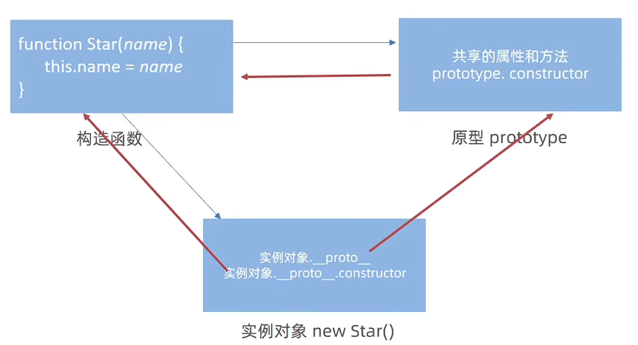
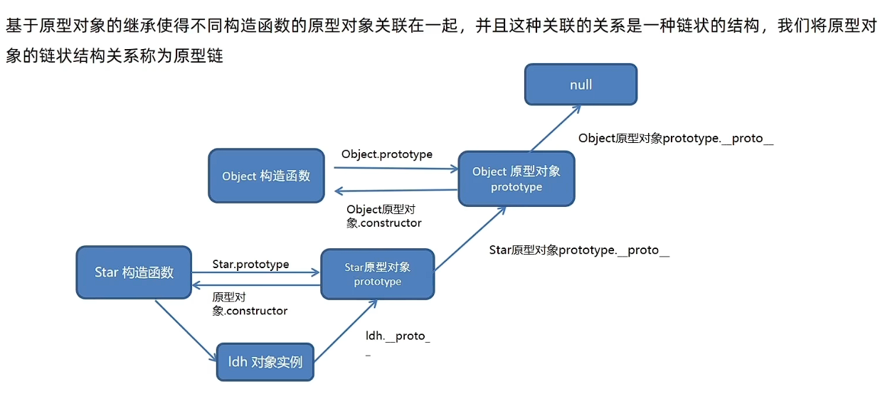

# 原型对象 （显式原型）

- 函数天生拥有一个属性 `prototype`, 是一个对象
- 意义：

1. 将构造函数中的一些固定的属性和方法挂载到原型上，在创建实例的时候，不需要重复执行这些属性和方法
2. 构造函数和原型对象中的 `this` 都指向实例化的对象

- 挂载在原型上的属性和方法，在实例对象中可以直接访问到

- 实例对象无法修改原型上的属性和方法
- 实例对象无法删除原型上的属性和方法

# 对象原型 （隐式原型）

1. 每一个对象都拥有一个属性 `__proto__`, 该属性值也是一个对象
2. v8 在访问对象中的属性时，会先访问对象上的显示拥有的属性，如果找不到，就会去对象的隐式原型中查找，也就是 `__proto__` 中查找

3. 实例对象的隐式原型`obj.__proto__` === 构造函数的显示原型`Object.prototype`

    1. 为什么？

    - new 的原理导致的

   ## new 的原理

    1. 创建一个空对象
    2. 让构造函数的 this 指向这个空对象
    3. 执行构造函数中的代码
    4. 将这个空对象的隐式原型 `__proto__` 赋值成 构造函数的显示原型
    5. 返回这个对象

4. 这么设计的意义是什么
   让实例对象继承到构造函数原型上的属性和方法，方便我们为某一个数据类型添加属性和方法

# 原型链

v8 在访问对象中的属性时，会先访问对象上的显示拥有的属性，如果找不到，就会去对象的隐式原型
也就是 `prototype 原型对象`中查找，如果还找不到，就会去 **隐式原型的隐式原型（原型对象的原型）** 中找，
层层往上，直到找到 `null (Object)` 为止

v8 的这种查找的链状关系就叫原型链

> 原型对象、对象原型、构造函数的关系指向

> 原型链示意图

# 没有原型的对象

- `Object.create(obj)`  创建一个新对象，让这个新对象的隐式原型等于传入的obj
- `Object.create(null)` 得到一个没有原型的对象

