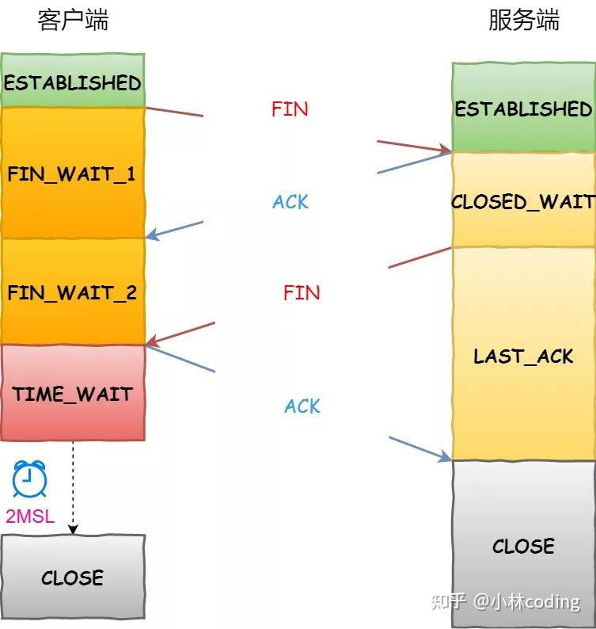

# TCP 协议 -- （Transmission Control Protocol 传输控制协议）

## 特点：

- 面向连接的协议
- 可靠的协议
- 有序的数据传输

## TCP的头

1. Sequence Number（序列号）
2. Acknowledgment Number（确认号）
3. Flags（标志位）
    - SYN: 发起一个连接 -- '1'代表**请求报文**
    - ACK: 确认序号有效 -- '1'代表**确认报文**
    - PSH: 接收方应该尽快将这个报文交给应用层
    - RST: **重置连接**
    - FIN: **释放一个连接**
4. Window Size（窗口大小）
5. Checksum（校验和）
6. Urgent Pointer（紧急指针）

## 1.面向连接：（三次握手）

- 第一次握手：客户端**发送`SYN`同步包**，请求与服务器建立连接，进入`SYN_SEND`状态
- 第二次握手：服务器**收到`SYN`包，回复`SYN-ACK`同步-确认包**，进入`SYN_RECV`状态
- 第三次握手：客户端**收到`SYN-ACK`包，回复`ACK`确认包**，连接建立，两端进入`ESTABLISHED`状态

### 追问：TCP 可不可以两次握手就建立连接？而是需要三次？

- 不可以：
    1. 因为三次握手是为了确定服务端和客户端都具备正常的接收和发送能力
    2. 防止服务器一直等待客户端的回信
    3. 客户端已经失效的连接请求又传送到了服务器

- 如果只进行两次握手：
    1. 在网络延迟和波动较大的情况下，可能会导致旧的、延迟的连接请求被服务端接收，服务器会错误地开启一个不再需要的连接，造成资源浪费
    2. 客户端因为意外没有接收到服务端的确认信息，无法确定是否连接成功。但此时服务端已经认为连接成功，会一直等待客户端的请求回信

## 2. 可靠的协议：（重传机制、拥塞控制）

- 重传机制：
    - 数据传输过程中，**TCP会对数据进行分段，并为每个数据段分配一个序列号**
    - **接收方会发送确认号**，告知发送方已经成功接收到的数据段
    - 如果发送方在一定时间内没有收到确认号，**会重新发送未确认的数据段**
- 拥塞控制：
    - TCP使用拥塞窗口（Congestion Window）来控制发送的数据量
    - 当**网络状况良好**时，拥塞窗口会逐渐增大，**允许更多的数据发送**
    - 当检测到**网络拥塞（如丢包或延迟增加）** 时，拥塞窗口会减小，**减少发送的数据量**，以缓解网络压力

## 3. 有序的数据传输：

- TCP使用序列号来标识每个数据段的顺序
- 接收方根据序列号将数据段重新组装成正确的顺序
- 如果数据段乱序到达，接收方会缓存这些数据段，直到所有数据段都到达并按顺序排列后，才将数据交给应用层

## 4. 四次挥手（http数据传输完毕后，断开连接）：

- 第一次挥手：**客户端发送一个`FIN`报文，表示数据发送完毕**，进入`FIN_WAIT_1`状态
- 第二次挥手：服务器收到`FIN`报文，**发送一个`ACK`报文，确认收到`FIN`**，进入`CLOSE_WAIT`状态
- 第三次挥手：**服务器发送一个`FIN`报文，表示数据发送完毕**，进入`LAST_ACK`状态
- 第四次挥手：客户端收到`FIN`报文，**发送一个`ACK`报文，确认收到`FIN`**，进入`TIME_WAIT`状态，**等待一段时间**后进入`CLOSED`状态

图解：

