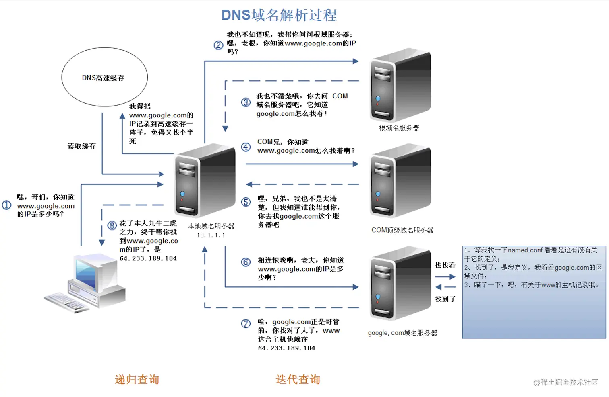

# 输入www.baidu.com后，浏览器发生了什么？

1. DNS 解析(域名解析) -- 将域名转换为IP地址 -- [参考文章](http://www.uml.org.cn/xjs/202203084.asp)
    - 浏览器先检查自己的DNS缓存中是否有该域名对应的IP地址
    - 客户端向本地DNS服务器发送请求
    - 本地DNS服务器向**根域名服务器(全球最上层服务器)** 发送查询请求
    - 本地DNS服务器向**顶级域名服务器(.com/.net/.org等服务器)** 发送查询请求
    - 本地DNS服务器向**权威域名服务器(baidu.com域名服务器)** 发送查询请求
    - 本地DNS服务器得到IP地址后**写入DNS高速缓存**并返回给浏览器

   图示：

   

2. 根据IP来使用TCP协议建立客户端和服务器的连接

   [TCP参考文章](TCP.md)

3. 使用HTTP进行数据传输

   [HTTP参考文章](HTTP.md)

